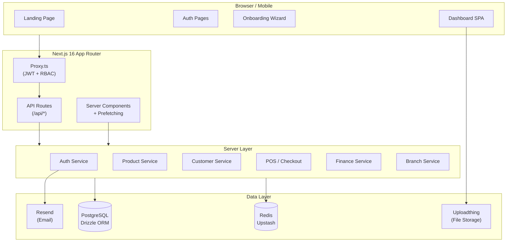
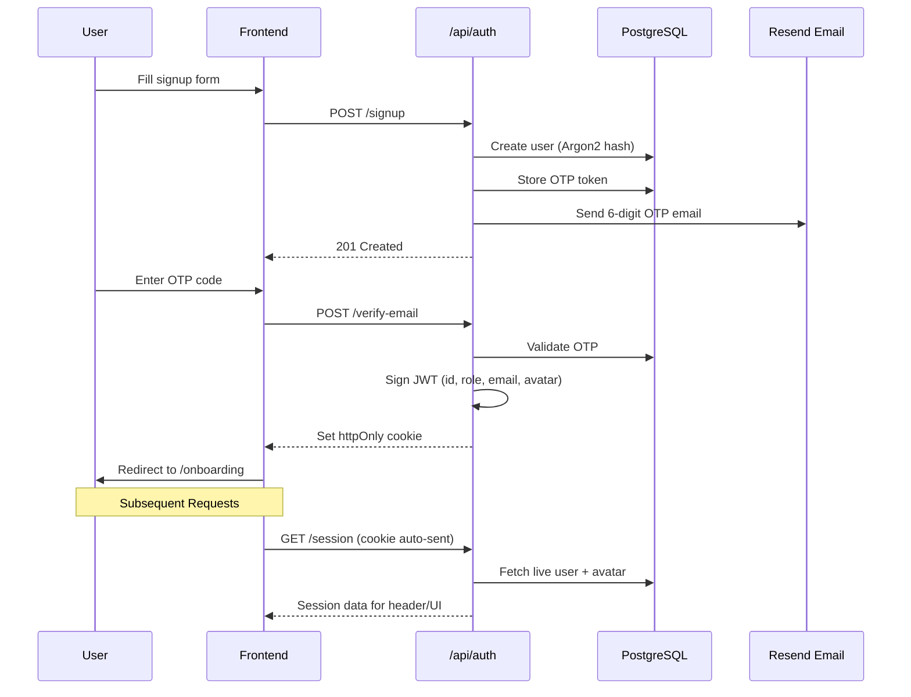
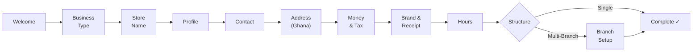
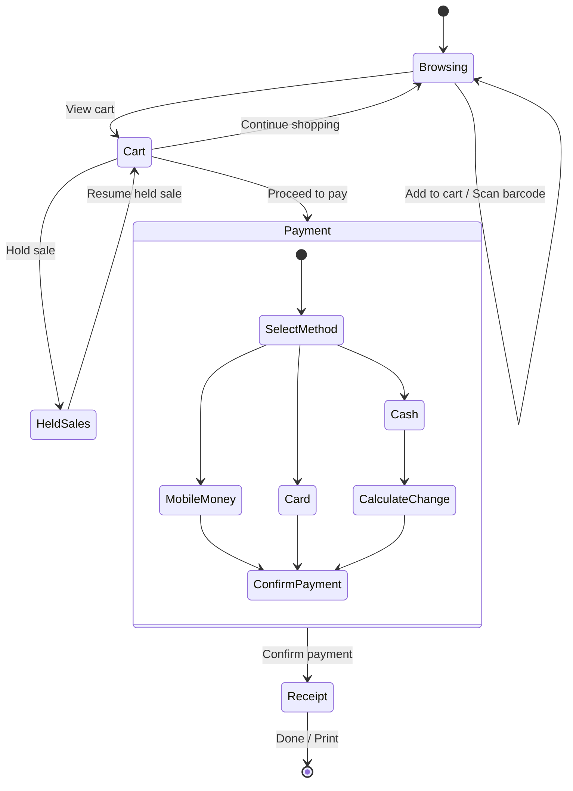
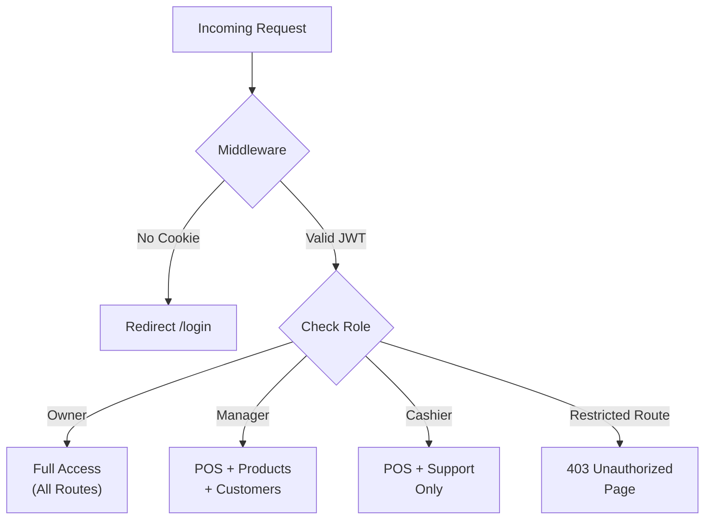
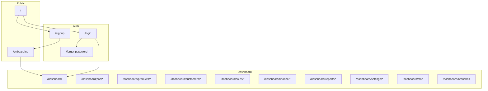
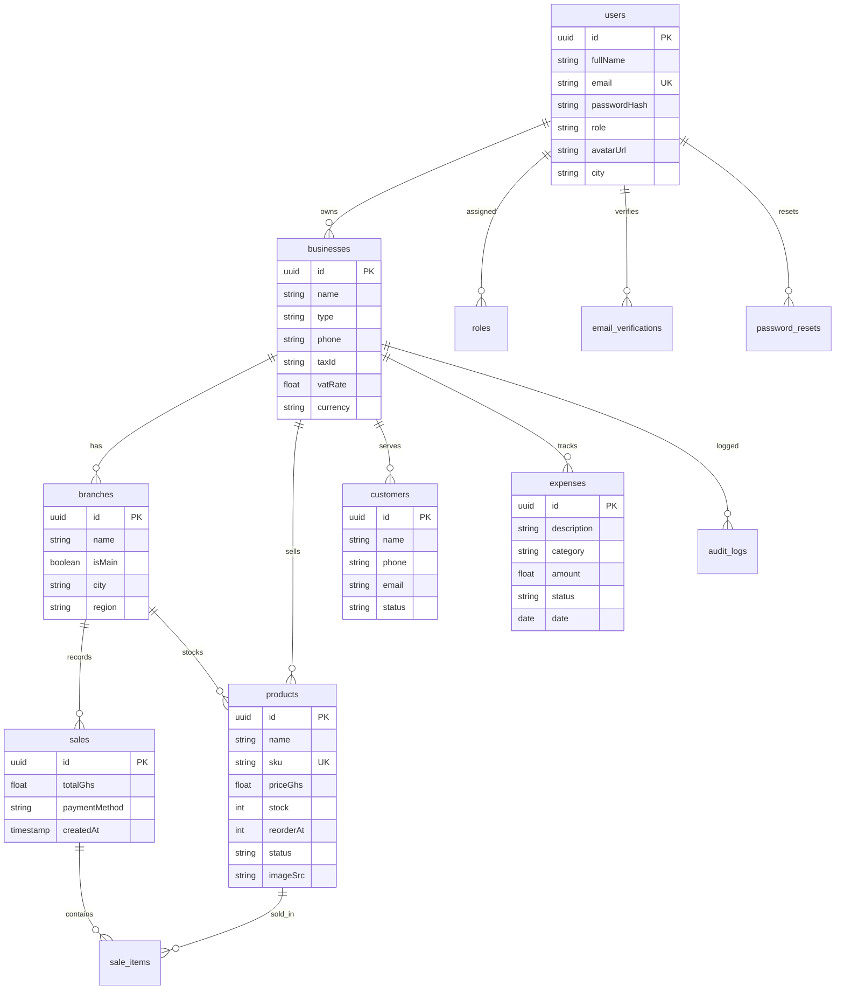
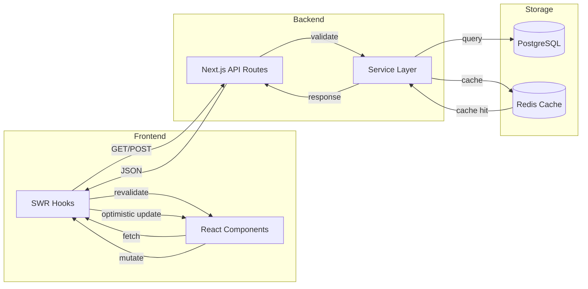

<p align="center">
  
</p>

<h1 align="center">VentraPOS</h1>

<p align="center">
  <strong>Cloud Point-of-Sale &amp; Business Operations Platform for Retailers in Ghana</strong>
</p>

<p align="center">
  Built with Next.js 16 · React 19 · TypeScript · Tailwind CSS v4 · PostgreSQL · Redis
</p>

---

## Overview

VentraPOS is a **production-ready**, **mobile-first** cloud POS and business management platform designed for retailers in **Ghana** and similar markets. It features **cedis (GHS)** defaults, Ghana's 16 regions, and receipt formats that local customers recognize.

The platform includes a **marketing landing page**, **secure authentication** (JWT + OTP email verification), **multi-step onboarding**, and a comprehensive **dashboard** — POS, product catalog, inventory, customers, finances, sales analytics, staff management, multi-branch support, and business settings — all backed by a **PostgreSQL database** with **Redis caching** for high-performance analytics.

## System Architecture



---

## Tech Stack

| Layer | Technology |
|-------|------------|
| **Framework** | [Next.js 16](https://nextjs.org/) (App Router) |
| **Frontend** | React 19, TypeScript 5 |
| **Styling** | Tailwind CSS v4, CSS custom properties (light/dark) |
| **Database** | PostgreSQL via [Drizzle ORM](https://orm.drizzle.team/) |
| **Caching** | [Upstash Redis](https://upstash.com/) |
| **Auth** | JWT (`jose`), Argon2 password hashing, OTP email verification |
| **File Uploads** | [Uploadthing](https://uploadthing.com/) |
| **Email** | [Resend](https://resend.com/) |
| **Charts** | [Recharts](https://recharts.org/) |
| **Data Fetching** | [SWR](https://swr.vercel.app/) (client), server-side prefetching |
| **Animations** | [Motion](https://motion.dev/) (Framer Motion) |
| **Barcodes** | `jsbarcode` (Code 128), `qrcode` (QR) |
| **Theming** | `next-themes` (light / dark) |
| **Fonts** | Plus Jakarta Sans (display), Inter (body) |

---

## Prerequisites

- **Node.js** 20+
- **pnpm** (recommended), npm, yarn, or bun
- **PostgreSQL** database
- **Redis** instance (Upstash recommended)

---

## Getting Started

```bash
# 1. Clone the repo
git clone https://github.com/Let-s-Code-GH/ventrapos.git
cd ventrapos

# 2. Install dependencies
pnpm install

# 3. Configure environment variables
cp .env.example .env.local
# Fill in: DATABASE_URL, UPSTASH_REDIS_URL, RESEND_API_KEY,
#          UPLOADTHING_TOKEN, JWT_SECRET, etc.

# 4. Push database schema
pnpm drizzle-kit push

# 5. Start development server
pnpm dev
```

Open **http://localhost:3000** in your browser.

---

## Database Schema

VentraPOS uses **Drizzle ORM** with PostgreSQL. The schema includes 12 core tables:

| Table | Purpose |
|-------|---------|
| `users` | User accounts, roles, avatar, profile data |
| `businesses` | Business profiles, tax config, branding |
| `branches` | Multi-branch locations and settings |
| `roles` | Role-based permissions (owner, manager, cashier) |
| `products` | Product catalog with images, SKU, pricing |
| `customers` | Customer directory and contact details |
| `sales` | Transaction records with line items |
| `expenses` | Operational cost tracking with categories |
| `email_verifications` | OTP verification tokens |
| `password_resets` | Password reset tokens |
| `audit_logs` | Activity tracking and audit trail |

---

## Features

### 🏠 Landing Page
- Premium hero section with floating header and dashboard imagery
- Feature showcase, analytics preview, security highlights
- Animated sections powered by Motion (Framer Motion)
- Responsive footer with social links

### 🔐 Authentication
- **Sign Up** — Email/password with OTP email verification via Resend
- **Login** — JWT-based sessions stored in `httpOnly` cookies, toast notifications on success
- **Forgot Password** — Email submission with resend cooldown
- **Role-Based Access Control** — Owner-only routes enforced via middleware; unauthorized users see a premium "Access Denied" page
- **Password Security** — Argon2 hashing via `@node-rs/argon2`



### 📋 Onboarding (Multi-Step Wizard)
- 10+ step guided setup: business type, store name, profile, contact, address (Ghana regions), tax/VAT, brand/logo, hours, and structure (single vs. multi-branch)
- Live **thermal receipt preview** during brand customization
- Dynamic branching: multi-branch selection adds additional setup steps
- Data persisted to database on completion



### 📊 Dashboard Home
- Greeting with real user data, KPI cards (revenue, orders, profit)
- Quick action shortcuts and recent activity feed
- Server-side prefetched analytics with Redis caching

### 💳 POS — Point of Sale
- **Product Grid** with category chips and morphing search bar
- **Cart** with quantity controls, hold/resume functionality
- **Barcode Scanner** — Camera-based Code 128 scanning with product resolution
- **Payment** — Ghana payment methods with tender/change calculation
- **Receipt** — Thermal-style summary with print/save options
- **Held Sales** — Park carts to `localStorage`, resume anytime
- **Sound Effects** — Add-to-cart beep for sensory feedback



### 📦 Products & Catalog
- **Product List** — Search, category/status filters, mobile card view
- **Add / Edit** — Photo upload (Uploadthing), auto-generated SKU, barcode generation (QR + Code 128)
- **Categories** — CRUD with live database sync, branch import support
- **Tags** — Product tagging system
- **Inventory** — Stock levels, reorder points, stock status badges, mobile cards
- **Bulk Operations** — CSV/Excel import & export

### 👥 Customers
- Full CRUD customer directory
- Search by name, phone, or email with status filters
- Mobile card layout with initials-based avatars

### 💰 Finance
- **Expenses** — Record and track operational costs with category/status indicators
- Mobile-first card layout with date and amount prominence

### 📈 Sales Analytics
- **Overview** — Revenue charts and top-selling products (Recharts)
- **Revenue** — Detailed revenue tracking
- **Profit** — Profit analysis
- **Transactions** — Transaction history with filters
- **Average Order Value** — AOV metrics and trends
- All analytics pages wrapped in `Suspense` for streaming

### 📄 Reports
- Sales Summary
- Inventory Valuation
- Tax Reports
- Z-Report (end-of-day)

### 🏢 Branches
- Multi-branch management with CRUD
- Branch context switching across the dashboard
- Main branch designation with category sync

### 👨‍💼 Staff Management
- Staff directory and role assignment
- Role-based permissions (owner, manager, cashier)

### ⚙️ Settings
- **Account** — Personal profile with real-time avatar upload (circular progress loader), SWR-driven instant updates
- **Business Profile** — Company details, tax configuration
- **Receipt** — Template customization
- **Security** — Password management
- **Billing** — Subscription information
- **Notifications** — Preference management

### 🛡️ Access Control
- Middleware-enforced route protection
- Non-owner staff restricted to Support & Sign Out
- Custom "Unauthorized" page for access violations



### 📱 Mobile-First Design
- **Card Layouts** — All data tables (Products, Inventory, Categories, Customers, Expenses) transform into touch-optimized cards on mobile
- **Responsive Forms** — Stacked layouts with full-width inputs and action buttons
- **Touch Interactions** — Active scale effects, horizontal scrolling for action bars
- **Adaptive Navigation** — Mobile sidebar with hamburger menu

---

## Route Map



| Route | Description |
|-------|-------------|
| `/` | Marketing landing page |
| `/signup` | Account creation → OTP verification → onboarding |
| `/login` | Sign in with email/password |
| `/forgot-password` | Password reset request |
| `/onboarding` | Multi-step business setup wizard |
| `/dashboard` | Home with KPIs and quick actions |
| `/dashboard/pos/sale` | POS terminal — browse, cart, pay, receipt |
| `/dashboard/pos/held` | Parked/held sales management |
| `/dashboard/products` | Product catalog with search and filters |
| `/dashboard/products/new` | Add new product |
| `/dashboard/products/[id]/edit` | Edit existing product |
| `/dashboard/products/categories` | Category management |
| `/dashboard/products/tags` | Tag management |
| `/dashboard/inventory` | Stock levels and reorder tracking |
| `/dashboard/customers` | Customer directory |
| `/dashboard/customers/new` | Add new customer |
| `/dashboard/sales/overview` | Sales overview with charts |
| `/dashboard/sales/revenue` | Revenue analytics |
| `/dashboard/sales/profit` | Profit analytics |
| `/dashboard/sales/transactions` | Transaction history |
| `/dashboard/sales/average-order-value` | AOV metrics |
| `/dashboard/finance` | Financial overview |
| `/dashboard/finance/expenses` | Expense tracking |
| `/dashboard/finance/expenses/new` | Record new expense |
| `/dashboard/reports/*` | Sales summary, inventory, tax, Z-report |
| `/dashboard/settings/*` | Account, business, receipt, security, billing |
| `/dashboard/staff` | Staff management |
| `/dashboard/branches` | Branch management |
| `/dashboard/support` | Support & help |
| `/dashboard/unauthorized` | Access denied page |

---

## Database Schema



---

## Data Flow



---

## Project Structure

```
ventrapos/
├── app/
│   ├── layout.tsx                    # Root layout, fonts, ThemeProvider
│   ├── page.tsx                      # Landing page
│   ├── globals.css                   # Theme tokens (light/dark CSS vars)
│   ├── onboarding/                   # Multi-step onboarding wizard
│   ├── (auth)/                       # Auth route group
│   │   ├── signup/
│   │   ├── login/
│   │   └── forgot-password/
│   ├── (dashboard)/                  # Dashboard route group
│   │   ├── layout.tsx                # App shell (sidebar + header)
│   │   └── dashboard/
│   │       ├── pos/                  # Point of Sale
│   │       ├── products/             # Product catalog
│   │       ├── inventory/            # Stock management
│   │       ├── customers/            # Customer directory
│   │       ├── sales/                # Sales analytics
│   │       ├── finance/              # Expenses & finance
│   │       ├── reports/              # Business reports
│   │       ├── settings/             # User & business settings
│   │       ├── staff/                # Staff management
│   │       ├── branches/             # Branch management
│   │       └── support/              # Help & support
│   ├── api/                          # API routes
│   │   ├── auth/                     # Login, signup, session, profile
│   │   ├── products/                 # Product & category CRUD
│   │   ├── customers/                # Customer CRUD
│   │   ├── pos/                      # Checkout & sales recording
│   │   ├── sales/                    # Analytics endpoints
│   │   ├── finance/                  # Expense management
│   │   ├── branches/                 # Branch CRUD
│   │   ├── staff/                    # Staff management
│   │   ├── dashboard/                # Dashboard KPIs
│   │   ├── business/                 # Business profile
│   │   ├── reports/                  # Report generation
│   │   └── uploadthing/              # File upload handler
│   ├── components/                   # UI components
│   │   ├── landing/                  # Marketing page components
│   │   ├── auth/                     # Auth form components
│   │   ├── onboarding/               # Onboarding step components
│   │   └── dashboard/                # Dashboard components
│   │       ├── header/               # Search, branch selector, notifications, user menu
│   │       ├── home/                 # Dashboard home widgets
│   │       ├── pos/                  # POS sale, cart, payment, receipt
│   │       ├── products/             # Product list, form, categories, inventory
│   │       ├── customers/            # Customer list and forms
│   │       ├── finance/              # Expense views
│   │       ├── sales/                # Sales analytics views
│   │       ├── settings/             # Settings views
│   │       └── branches/             # Branch management views
│   └── lib/                          # Utilities and helpers
├── server/                           # Backend service layer
│   ├── db/                           # Database connection & schema
│   │   └── schema/                   # Drizzle ORM table definitions
│   ├── auth/                         # Auth service, token service (JWT)
│   ├── products/                     # Product service
│   ├── customers/                    # Customer service
│   ├── pos/                          # POS/checkout service
│   ├── branches/                     # Branch service
│   ├── businesses/                   # Business profile service
│   ├── finance/                      # Finance/expense service
│   ├── staff/                        # Staff service
│   ├── onboarding/                   # Onboarding service
│   ├── config/                       # App configuration
│   └── lib/                          # Shared server utilities
├── public/                           # Static assets
│   ├── landing/                      # Landing page images
│   ├── onboarding/                   # Onboarding illustrations
│   └── sounds/pos/                   # POS sound effects
├── DESIGN.md                         # Design system documentation
└── docs/                             # PR notes and documentation
```

---

## API Routes

| Endpoint | Methods | Purpose |
|----------|---------|---------|
| `/api/auth/login` | POST | Authenticate user, issue JWT |
| `/api/auth/signup` | POST | Create account, send OTP |
| `/api/auth/verify-email` | POST | Verify OTP code |
| `/api/auth/session` | GET | Get current session with live profile data |
| `/api/auth/profile` | PUT | Update user profile (name, city, avatar) |
| `/api/products` | GET, POST | List/create products |
| `/api/products/[id]` | PUT, DELETE | Update/delete product |
| `/api/products/categories` | GET, POST | List/create categories |
| `/api/customers` | GET, POST | List/create customers |
| `/api/customers/[id]` | PUT, DELETE | Update/delete customer |
| `/api/pos/checkout` | POST | Process sale atomically |
| `/api/sales/*` | GET | Sales analytics (overview, revenue, profit, etc.) |
| `/api/dashboard/home` | GET | Dashboard KPIs with Redis caching |
| `/api/finance/expenses` | GET, POST | List/create expenses |
| `/api/branches` | GET, POST | Branch management |
| `/api/staff` | GET, POST | Staff management |
| `/api/business/*` | GET, PUT | Business profile & settings |
| `/api/uploadthing` | POST | File upload handler |

---

## Design System

**Design direction:** [Financial Atelier](DESIGN.md) — tonal surfaces, green gradient CTAs, premium dark mode.

| Token | Value |
|-------|-------|
| Primary | `#003527` → `#064e3b` (gradient) |
| Accent | `#006c49` (light) / `#6ffbbe` (dark) |
| Display Font | Plus Jakarta Sans |
| Body Font | Inter |
| Radius | `0.75rem` (cards) / `1.25rem` (panels) |

See `DESIGN.md` and `.cursor/rules/design-system.mdc` for full details.

---

## Scripts

| Command | Action |
|---------|--------|
| `pnpm dev` | Start development server |
| `pnpm build` | Production build |
| `pnpm start` | Run production server |
| `pnpm lint` | Run ESLint |
| `pnpm drizzle-kit push` | Push schema to database |
| `pnpm drizzle-kit studio` | Open Drizzle Studio (DB GUI) |

---

## Environment Variables

| Variable | Description |
|----------|-------------|
| `DATABASE_URL` | PostgreSQL connection string |
| `UPSTASH_REDIS_REST_URL` | Redis URL for caching |
| `UPSTASH_REDIS_REST_TOKEN` | Redis auth token |
| `RESEND_API_KEY` | Email service API key |
| `UPLOADTHING_TOKEN` | File upload service token |
| `JWT_SECRET` | Secret for signing JWTs |

---

## Documentation

| File | Purpose |
|------|---------|
| `DESIGN.md` | Financial Atelier design principles |
| `.cursor/rules/about.mdc` | Product context |
| `.cursor/rules/screens.mdc` | Screen inventory & roadmap |
| `.cursor/rules/design-system.mdc` | AI-facing design specifications |
| `docs/pr-*.md` | Pull request notes for major features |

---

## Roadmap

- [ ] Real-time notifications via WebSocket/SSE
- [ ] GPS/Map integration for branch addresses
- [ ] Receipt printing via thermal printer API
- [ ] Offline mode with service workers
- [ ] Mobile companion app (React Native)
- [ ] Advanced reporting with PDF export
- [ ] Loyalty program and customer rewards
- [ ] Supplier management and purchase orders

---

## License

Private project — © VentraPOS. All rights reserved.
